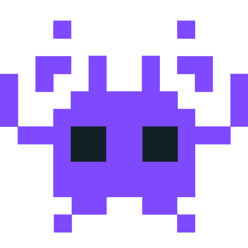

 
<h1 align="center">¡Hola, soy Tomás Villarreal - Tomasvi!</h1>

<h2> Sobre mi:</h2>

###  Actualmente estudiando Programación Web Full Stack en Digital House. 
-  Me gustan los videojuegos.
-  Aplicar el pensamiento lógico.
-  Aprender cosas nuevas y reforzar mis conocimientos constantemente.

---

<h3 align="center"> Lenguajes y herramientas </h3>

 
  
  
  
  
  
  
  
  
  
  
  
  

---

 

<h3 align="left">   GitHub Stats</h3>

    
  

